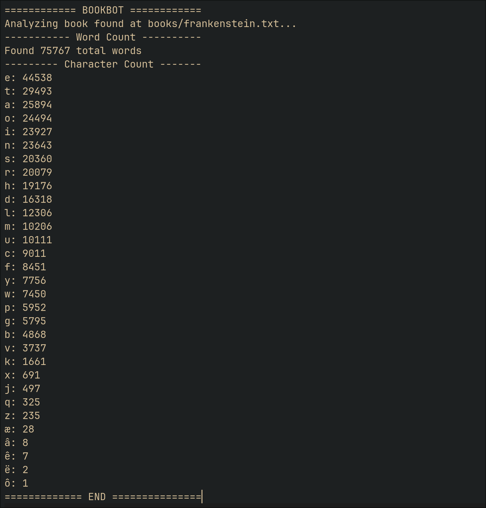

# bookbot

python script for counting words and alphabetic characters in a .txt file

## Installation

1. Clone the repository
2. Create `books` directory in the root of the project
3. Place your `.txt` files in the `books` directory

## Usage

```bash
python3 main.py <filename>
```

## Example



